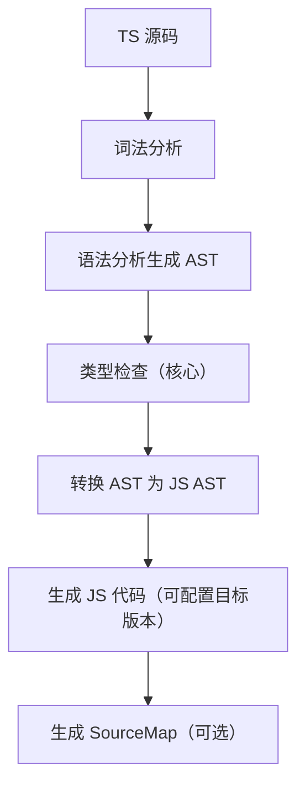

# TypeScript 超细分大厂面试题集（基础+高级+工程化）

本套题集覆盖 TypeScript（简称 TS）全维度核心考点，从**基础类型系统、核心语法、高级类型编程**到**工程化配置、框架集成、性能优化**，每个问题配套**标准答案、高频坑点、面试官追问、实战代码**，完全匹配大厂中高级前端/全栈面试的深度与细节要求。

---

## 第一部分：TypeScript 基础核心（入门必问）

### 一、类型系统核心概念

#### Q1：TypeScript 与 JavaScript 的核心区别？TS 的编译流程？

**标准答案**：

1. 核心区别（本质：TS 是 JS 的超集，添加静态类型系统）：

| 维度       | JavaScript                 | TypeScript                              |
| ---------- | -------------------------- | --------------------------------------- |
| 类型检查   | 动态类型（运行时检查）     | 静态类型（编译时检查）                  |
| 类型错误   | 运行时暴露                 | 编译时暴露                              |
| 语言特性   | 仅 ES 标准特性             | 包含 ES 所有特性 + 类型注解/接口/泛型等 |
| 运行环境   | 浏览器/Node.js 直接运行    | 需编译为 JS 后运行                      |
| 工程化支持 | 弱（无类型约束，易出 bug） | 强（类型约束，提升可维护性）            |

1. TS 编译流程（TSC 编译器核心步骤）：



    - 关键：**类型检查仅在编译阶段执行**，运行时无 TS 类型信息（类型擦除）；若类型错误但语法无错，TSC 仍可生成 JS 代码（可通过 `noEmitOnError` 禁用）。

**坑点**：TS 无法检测运行时类型错误（如 API 返回数据类型与定义不符），需结合运行时校验（如 Zod/ajv）。

**追问**：TS 的“类型擦除”带来哪些限制？

#### Q2：类型注解（Type Annotation）与类型推断（Type Inference）的区别？TS 推断规则？

**标准答案**：

1. 核心定义：

   - **类型注解**：开发者显式指定变量/函数的类型（`let a: number = 1`）；

   - **类型推断**：TS 编译器自动推导变量/函数的类型（`let a = 1` → 推断为 `number`）。

2. TS 类型推断核心规则：

   - 变量初始化时：根据赋值推导类型（`let str = 'hello'` → `string`）；

   - 函数返回值：根据 return 语句推导（`function add(a: number, b: number) { return a + b }` → 返回值推断为 `number`）；

   - 解构赋值：根据解构源推导（`const { name } = { name: 'ts' }` → `name: string`）；

   - 上下文推断：根据使用场景推导（`const arr = [1, '2']` → `(number | string)[]`）。

3. 需显式注解的场景（推断失效/不精准）：

   - 变量声明后赋值（`let a: number; a = 1`）；

   - 函数参数（TS 不会推断参数类型，默认 `any`）；

   - 复杂对象/联合类型（需精准约束）；

   - 函数返回值为 `any` 时（需显式注解避免类型污染）。

**实战示例**：

```TypeScript

// 类型推断
let num = 10; // 推断为 number
const PI = 3.14; // 推断为 3.14（字面量类型，const 常量）
const arr = [1, 'hello']; // 推断为 (number | string)[]

// 类型注解（显式指定）
let str: string;
str = 'TS'; // 正确
// str = 123; // 编译错误：Type 'number' is not assignable to type 'string'

// 函数注解
function sum(a: number, b: number): number {
  return a + b;
}
```

**坑点**：`let` 变量初始化后，类型会固定（`let a = 1; a = '1'` 报错），但 `any` 类型可绕过此限制。

#### Q3：TS 基本类型（Primitive Types）细节？null/undefined/never/void 的区别？

**标准答案**：

1. 核心基本类型（与 JS 对应 + TS 扩展）：

   - 基础：`string`/`number`/`boolean`/`symbol`/`bigint`；

   - 空值：`null`/`undefined`（TS 默认视为所有类型的子类型，可通过 `strictNullChecks` 禁用）；

   - 无返回：`void`（函数无返回值，仅可赋值 `undefined`/`null`）；

   - 永不存在：`never`（函数永远不会返回，如抛出错误/无限循环）；

   - 任意值：`any`（关闭类型检查，类型污染源头，慎用）；

   - 未知值：`unknown`（安全版 `any`，需类型守卫后才能使用）。

2. 关键区别（高频考点）：

| 类型      | 含义         | 赋值规则                                  | 典型场景                                        |
| --------- | ------------ | ----------------------------------------- | ----------------------------------------------- |
| void      | 函数无返回值 | 仅可赋值 `undefined`/`null`（非严格模式） | `function log(): void { console.log('hi') }`    |
| never     | 永不存在的值 | 不能赋值给任何类型（自身除外）            | `function error(): never { throw new Error() }` |
| null      | 空引用       | 严格模式下仅可赋值给 `null`/`any`         | 显式空值标记                                    |
| undefined | 未定义       | 严格模式下仅可赋值给 `undefined`/`any`    | 变量未初始化/函数无返回值                       |
| unknown   | 未知类型     | 需类型守卫后才能使用                      | 接收任意类型输入（如 API 响应）                 |

1. 实战示例：

```TypeScript

// void
function fn1(): void {
  return; // 正确
  // return 1; // 错误：Type 'number' is not assignable to type 'void'
}
let v: void = undefined; // 正确（严格模式下）

// never
function fn2(): never {
  while (true) {} // 无限循环，永无返回
}
function fn3(): never {
  throw new Error('error'); // 抛出错误，永无返回
}
// let n: never = 1; // 错误：Type 'number' is not assignable to type 'never'

// unknown（安全版 any）
let u: unknown = 1;
u = 'hello';
// u.toFixed(); // 错误：Object is of type 'unknown'
if (typeof u === 'number') {
  u.toFixed(); // 正确：类型守卫后使用
}
```

**坑点**：开启 `strictNullChecks` 后，`string` 类型变量不能赋值 `null`/`undefined`，需用联合类型（`string | null`）。

### 二、接口与类型别名

#### Q4：Interface（接口）与 Type Alias（类型别名）的核心区别？适用场景？

**标准答案**：

1. 核心区别（大厂高频对比）：

| 维度     | Interface                       | Type Alias                                |
| -------- | ------------------------------- | ----------------------------------------- |
| 定义方式 | `interface A { ... }`           | `type A = { ... }`                        |
| 扩展方式 | 用 `extends` 扩展（支持多继承） | 用 `&` 交叉扩展（`type B = A & { ... }`） |
| 合并规则 | 支持同名合并（声明合并）        | 不支持同名合并（重复定义报错）            |
| 适用类型 | 仅对象/函数类型                 | 支持所有类型（基本类型/联合/元组等）      |
| 计算属性 | 不支持（TS 4.4+ 部分支持）      | 支持（如 `type Key = 'a'                  |
| 泛型支持 | 支持                            | 支持                                      |

1. 声明合并（Interface 独有）：

```TypeScript

// 接口合并：同名接口自动合并属性
interface User {
  name: string;
}
interface User {
  age: number;
}
const user: User = { name: 'TS', age: 20 }; // 正确：合并后 { name: string; age: number }

// 类型别名：重复定义报错
// type User = { name: string };
// type User = { age: number }; // 错误：Duplicate identifier 'User'
```

1. 适用场景：

   - **Interface**：定义对象/函数的形状，需要扩展/合并（如组件 Props、API 响应类型）；

   - **Type Alias**：定义联合类型/元组/字面量类型，或需要计算属性（如 `type Status = 'success' | 'error'`）。

**追问**：接口扩展与交叉类型的区别？（接口扩展会覆盖重复属性，交叉类型会保留重复属性为 `never`）

#### Q5：接口的可选属性、只读属性、索引签名？实战场景？

**标准答案**：

1. 核心语法：

   - **可选属性**：`?` 标记，属性可不存在；

   - **只读属性**：`readonly` 标记，属性不可修改；

   - **索引签名**：定义动态键名的类型（字符串/数字索引）。

2. 实战示例：

```TypeScript

// 可选属性 + 只读属性
interface User {
  readonly id: number; // 只读，不可修改
  name: string;
  age?: number; // 可选，可不存在
}

const user: User = { id: 1, name: 'TS' };
// user.id = 2; // 错误：Cannot assign to 'id' because it is a read-only property
user.age = 20; // 正确

// 索引签名（处理动态键）
// 字符串索引：键为 string，值为 number
interface NumberMap {
  [key: string]: number;
  size: number; // 必须符合索引签名类型（number）
  // name: string; // 错误：Type 'string' is not assignable to type 'number'
}

const map: NumberMap = { size: 10, a: 1, b: 2 };

// 数字索引：键为 number，值为 string
interface StringArray {
  [index: number]: string;
}
const arr: StringArray = ['a', 'b'];
console.log(arr[0]); // 正确：'a'
```

1. 高频坑点：

   - 索引签名需覆盖所有显式属性类型（如字符串索引值为 `number`，显式属性不能是 `string`）；

   - 数字索引是字符串索引的子集（JS 中 `obj[1]` 等价于 `obj['1']`），因此数字索引类型需兼容字符串索引类型。

### 三、函数类型与类型收窄

#### Q6：TS 函数类型定义方式？重载、可选参数、默认参数、剩余参数的细节？

**标准答案**：

1. 函数类型定义的 3 种方式：

```TypeScript

// 方式 1：直接注解参数/返回值
function add1(a: number, b: number): number {
  return a + b;
}

// 方式 2：类型别名定义函数类型
type AddFunc = (a: number, b: number) => number;
const add2: AddFunc = (a, b) => a + b;

// 方式 3：接口定义函数类型
interface AddInterface {
  (a: number, b: number): number;
}
const add3: AddInterface = (a, b) => a + b;
```

1. 函数参数细节：

   - **可选参数**：`?` 标记，必须放在必选参数后；

   - **默认参数**：自动推断为可选，可放在必选参数前（需显式传 `undefined`）；

   - **剩余参数**：`...rest` 注解为数组类型；

   - **函数重载**：定义多个函数签名，适配不同参数/返回值（仅 TS 编译阶段有效）。

2. 实战示例：

```TypeScript

// 可选参数 + 默认参数
function fn1(a: number, b?: number, c: number = 10): number {
  return a + (b || 0) + c;
}
fn1(1); // 正确：1 + 0 + 10 = 11
fn1(1, 2); // 正确：1 + 2 + 10 = 13
fn1(1, 2, 3); // 正确：1 + 2 + 3 = 6

// 剩余参数
function fn2(...args: number[]): number {
  return args.reduce((sum, val) => sum + val, 0);
}
fn2(1, 2, 3); // 6

// 函数重载（核心：先定义签名，再实现）
// 重载签名（2 个）
function format(value: string): string;
function format(value: number): number;
// 实现签名（需兼容所有重载签名）
function format(value: string | number): string | number {
  if (typeof value === 'string') {
    return value.toUpperCase();
  } else {
    return value * 2;
  }
}
format('ts'); // 正确：'TS'
format(10); // 正确：20
// format(true); // 错误：No overload matches this call
```

**坑点**：函数重载的实现签名不能直接调用，仅重载签名可被调用；实现签名需覆盖所有重载签名的参数/返回值类型。

#### Q7：Type Narrowing（类型收窄/类型守卫）的常用方式？typeof/instanceof/in/自定义守卫？

**标准答案**：

1. 核心定义：类型收窄是通过代码逻辑，将宽泛的类型（如 `unknown`/`联合类型`）缩小为更具体的类型，避免类型错误。

2. 常用类型守卫方式：

| 方式       | 语法示例                                                                      | 适用场景                             |
| ---------- | ----------------------------------------------------------------------------- | ------------------------------------ |
| typeof     | `typeof x === 'string'`                                                       | 基本类型（string/number/boolean 等） |
| instanceof | `x instanceof Array`                                                          | 类/构造函数创建的对象                |
| in         | `'name' in x`                                                                 | 对象属性存在性检查                   |
| 字面量相等 | `x === 'success'`                                                             | 字面量类型收窄                       |
| 自定义守卫 | `function isNumber(x: unknown): x is number { return typeof x === 'number' }` | 复杂类型判断                         |

1. 实战示例：

```TypeScript

// 1. typeof 守卫
function printValue(x: string | number) {
  if (typeof x === 'string') {
    console.log(x.toUpperCase()); // x 收窄为 string
  } else {
    console.log(x.toFixed(2)); // x 收窄为 number
  }
}

// 2. instanceof 守卫
class User { name: string }
class Product { price: number }
function getInfo(obj: User | Product) {
  if (obj instanceof User) {
    console.log(obj.name); // obj 收窄为 User
  } else {
    console.log(obj.price); // obj 收窄为 Product
  }
}

// 3. in 守卫
interface Cat { meow(): void }
interface Dog { bark(): void }
function animalSound(animal: Cat | Dog) {
  if ('meow' in animal) {
    animal.meow(); // animal 收窄为 Cat
  } else {
    animal.bark(); // animal 收窄为 Dog
  }
}

// 4. 自定义类型守卫（核心：返回值为 `x is T`）
interface Admin { role: 'admin'; permissions: string[] }
interface User { role: 'user'; name: string }
function isAdmin(user: Admin | User): user is Admin {
  return user.role === 'admin';
}

function getPermissions(user: Admin | User) {
  if (isAdmin(user)) {
    console.log(user.permissions); // user 收窄为 Admin
  } else {
    console.log(user.name); // user 收窄为 User
  }
}
```

**关键**：自定义类型守卫的返回值类型是 `x is T`（类型谓词），而非 `boolean`，TS 会根据返回值自动收窄类型。

---

## 第二部分：TypeScript 高级类型（大厂必问核心）

### 四、泛型（Generics）

#### Q8：泛型的核心作用？泛型约束、默认值、条件约束的细节？

**标准答案**：

1. 核心作用：泛型是“类型参数”，让类型可复用、可动态调整，避免重复定义相似类型（如 `Array<string>`/`Array<number>` 共用 `Array<T>` 类型）。

2. 基础语法：

```TypeScript

// 泛型函数
function identity<T>(arg: T): T {
  return arg;
}
identity<string>('hello'); // 显式指定 T 为 string
identity(10); // 自动推断 T 为 number

// 泛型接口
interface Box<T> {
  value: T;
}
const box: Box<number> = { value: 10 };

// 泛型类
class Queue<T> {
  private data: T[] = [];
  push(item: T) { this.data.push(item); }
  pop(): T | undefined { return this.data.shift(); }
}
const queue = new Queue<number>();
queue.push(1);
```

1. 泛型约束（限制泛型的范围）：

```TypeScript

// 基础约束：T 必须包含 name 属性
interface HasName { name: string }
function printName<T extends HasName>(obj: T) {
  console.log(obj.name);
}
printName({ name: 'TS' }); // 正确
// printName({ age: 20 }); // 错误：缺少 name 属性

// 泛型默认值（TS 2.3+）
function createArray<T = string>(length: number, value: T): T[] {
  return Array(length).fill(value);
}
createArray(3, 'a'); // string[]（默认 T 为 string）
createArray<number>(3, 1); // number[]（显式指定）

// 条件约束（结合 extends 条件判断）
type IsString<T> = T extends string ? true : false;
type A = IsString<string>; // true
type B = IsString<number>; // false
```

1. 高频坑点：

   - 泛型约束不能使用基本类型（如 `T extends string` 是允许的，但 `T extends 1` 是字面量约束）；

   - 泛型默认值需放在约束后（`T extends HasName = DefaultType`）。

**追问**：泛型与 any 的区别？（泛型保留类型信息，any 丢失类型信息）

#### Q9：泛型工具类型（Utility Types）的实现原理？Partial/Required/Readonly/Pick/Omit/Record？

**标准答案**：

TS 内置的泛型工具类型均基于**映射类型 + 条件类型**实现，以下是核心工具类型的源码级解析：

1. `**Partial<T>**`：将 T 的所有属性变为可选

```TypeScript

// 实现源码
type Partial<T> = {
  [P in keyof T]?: T[P];
};
// 用法
interface User { name: string; age: number }
type PartialUser = Partial<User>; // { name?: string; age?: number }
```

1. `**Required<T>**`：将 T 的所有属性变为必选（反向 Partial）

```TypeScript

type Required<T> = {
  [P in keyof T]-?: T[P]; // -? 移除可选标记
};
type RequiredUser = Required<PartialUser>; // 恢复为 User
```


1. `**Readonly<T>**`：将 T 的所有属性变为只读

```TypeScript

type Readonly<T> = {
  readonly [P in keyof T]: T[P];
};
type ReadonlyUser = Readonly<User>; // { readonly name: string; readonly age: number }
```

1. `**Pick<T, K>**`：从 T 中选取指定属性 K 组成新类型

```TypeScript

type Pick<T, K extends keyof T> = {
  [P in K]: T[P];
};
type UserName = Pick<User, 'name'>; // { name: string }
```
1. `**Omit<T, K>**`：从 T 中排除指定属性 K 组成新类型（基于 Pick + Exclude）

```TypeScript

// 先实现 Exclude（排除联合类型中的指定类型）
type Exclude<T, U> = T extends U ? never : T;
// Omit 实现
type Omit<T, K extends keyof T> = Pick<T, Exclude<keyof T, K>>;
type UserWithoutAge = Omit<User, 'age'>; // { name: string }
```

1. `**Record<K, T>**`：创建键为 K、值为 T 的对象类型

```TypeScript

type Record<K extends keyof any, T> = {
  [P in K]: T;
};
// 用法：定义键为 'success'/'error'，值为 string 的对象
type StatusMsg = Record<'success' | 'error', string>;
const msg: StatusMsg = { success: '成功', error: '失败' };
```

**实战扩展**：自定义工具类型

```TypeScript

// 自定义：将 T 的所有属性变为可选且只读
type PartialReadonly<T> = {
  readonly [P in keyof T]?: T[P];
};
type CustomUser = PartialReadonly<User>; // { readonly name?: string; readonly age?: number }
```

#### Q10：Distributive Conditional Types（分布式条件类型）原理？Exclude/Extract 的实现？

**标准答案**：

1. 核心原理：当条件类型的泛型参数是**联合类型**时，TS 会自动将联合类型的每个成员分别代入条件判断，最终返回联合类型（“分布式”特性）。

   ```TypeScript

   type Conditional<T> = T extends string ? string : number;
   type Union = string | number | boolean;
   type Result = Conditional<Union>;
   // 分步计算：
   // string extends string → string
   // number extends string → number
   // boolean extends string → number
   // 最终 Result = string | number | number → string | number
   ```

2. 禁用分布式：将泛型参数用方括号包裹（`[T] extends [string]`）。

   ```TypeScript

   type NonDistributive<T> = [T] extends [string] ? string : number;
   type Result2 = NonDistributive<Union>; // number（整个联合类型判断，非分布式）
   ```

3. 基于分布式条件类型的内置工具：

   - **Exclude<T, U>**：从 T 中排除可赋值给 U 的类型

     ```TypeScript

     type Exclude<T, U> = T extends U ? never : T;
     type E = Exclude<'a' | 'b' | 'c', 'a'>; // 'b' | 'c'
     ```

   - **Extract<T, U>**：从 T 中提取可赋值给 U 的类型（反向 Exclude）

     ```TypeScript

     type Extract<T, U> = T extends U ? T : never;
     type E2 = Extract<'a' | 'b' | 'c', 'a' | 'd'>; // 'a'
     ```

**关键**：分布式条件类型是实现 Exclude/Omit/ReturnType 等工具类型的核心基础。

### 五、高级类型进阶

#### Q11：ReturnType/Parameters/ConstructorParameters 的实现与用法？

**标准答案**：

这三个工具类型用于提取函数/构造函数的返回值、参数类型，是泛型 + 条件类型的经典应用：

1. `**ReturnType<T>**`：提取函数 T 的返回值类型

```TypeScript

// 实现源码（简化版）
type ReturnType<T extends (...args: any) => any> = T extends (...args: any) => infer R ? R : any;
// 核心：infer 关键字（推断类型，仅在条件类型中使用）

// 用法
function add(a: number, b: number): number {
  return a + b;
}
type AddReturn = ReturnType<typeof add>; // number

// 箭头函数
const multiply = (a: number, b: number) => a * b;
type MultiplyReturn = ReturnType<typeof multiply>; // number
```

1. `**Parameters<T>**`：提取函数 T 的参数类型（返回元组）

```TypeScript

// 实现源码
type Parameters<T extends (...args: any) => any> = T extends (...args: infer P) => any ? P : never;

// 用法
type AddParams = Parameters<typeof add>; // [number, number]
// 解构参数类型
type [A, B] = AddParams; // A = number, B = number
```

1. `**ConstructorParameters<T>**`：提取构造函数 T 的参数类型

```TypeScript

// 实现源码
type ConstructorParameters<T extends abstract new (...args: any) => any> = T extends abstract new (...args: infer P) => any ? P : never;

// 用法
class User {
  constructor(name: string, age: number) {}
}
type UserCtorParams = ConstructorParameters<typeof User>; // [string, number]
```

**核心**：`infer` 关键字用于在条件类型中“推断”未知类型，是实现类型提取的关键。

#### Q12：Mapped Types（映射类型）的核心语法？只读/可选/键重映射？

**标准答案**：

1. 核心定义：映射类型是通过遍历已有类型的键，创建新类型的方式（语法：`[P in K]: T`），是实现工具类型的基础。

2. 基础映射：

```TypeScript

// 遍历联合类型作为键
type Keys = 'a' | 'b' | 'c';
type MyMap = { [P in Keys]: number }; // { a: number; b: number; c: number }

// 遍历对象的键（结合 keyof）
interface User { name: string; age: number }
type UserMap = { [P in keyof User]: boolean }; // { name: boolean; age: boolean }
```

1. 键重映射（TS 4.1+，`as` 关键字）：

```TypeScript

// 语法：[P in K as NewKey]: T
type User = { name: string; age: number };
// 将键转为大写
type UppercaseUser = { [P in keyof User as Uppercase<P>]: User[P] };
// { NAME: string; AGE: number }

// 过滤键（返回 never 则排除该键）
type FilterNumberKeys<T> = {
  [P in keyof T as T[P] extends number ? P : never]: T[P];
};
type UserNumberKeys = FilterNumberKeys<User>; // { age: number }
```

1. 组合修饰符（readonly/?）：

```TypeScript

// 只读 + 可选
type ReadonlyPartial<T> = {
  readonly [P in keyof T]?: T[P];
};
type RPU = ReadonlyPartial<User>; // { readonly name?: string; readonly age?: number }
```

#### Q13：Indexed Access Types（索引访问类型）的用法？嵌套对象类型提取？

**标准答案**：

1. 核心语法：`T[K]`，通过键 K 提取类型 T 中对应属性的类型（K 需是 T 的键）。

2. 基础用法：

```TypeScript

interface User {
  name: string;
  age: number;
  address: {
    city: string;
    street: string;
  };
  hobbies: string[];
}

// 提取单个属性类型
type UserName = User['name']; // string
type UserAddress = User['address']; // { city: string; street: string }

// 提取嵌套属性类型
type UserCity = User['address']['city']; // string

// 提取数组元素类型
type Hobby = User['hobbies'][number]; // string（number 索引提取数组元素）

// 提取多个属性类型（联合键）
type UserNameAge = User['name' | 'age']; // string | number
```

1. 实战场景：提取 API 响应的嵌套类型

```TypeScript

interface ApiResponse {
  code: number;
  data: {
    list: { id: number; title: string }[];
    total: number;
  };
  msg: string;
}

// 提取列表项类型
type ListItem = ApiResponse['data']['list'][number]; // { id: number; title: string }
```

**坑点**：索引访问类型中，数组元素提取需用 `number` 作为索引（`T[]` 等价于 `{ [index: number]: T }`）。

---

## 第三部分：TypeScript 工程化实践

### 六、TSConfig 配置详解

#### Q14：tsconfig.json 核心配置项？strict 模式包含哪些子规则？

**标准答案**：

tsconfig.json 是 TS 编译的核心配置文件，以下是大厂高频关注的配置项：

1. 核心编译配置：

| 配置项                             | 作用                                   | 推荐值（生产环境）                               |
| ---------------------------------- | -------------------------------------- | ------------------------------------------------ |
| `compilerOptions.target`           | 编译目标 ES 版本                       | ES2020/ESNext                                    |
| `compilerOptions.module`           | 模块系统（CommonJS/ESNext/ES6）        | ESNext（前端）/CommonJS（Node.js）               |
| `compilerOptions.moduleResolution` | 模块解析策略                           | NodeNext（兼容 ESM/CJS）                         |
| `compilerOptions.outDir`           | 编译输出目录                           | ./dist                                           |
| `compilerOptions.rootDir`          | 源码根目录                             | ./src                                            |
| `compilerOptions.sourceMap`        | 是否生成 SourceMap                     | true                                             |
| `compilerOptions.strict`           | 开启严格模式（包含所有子规则）         | true（生产环境必开）                             |
| `compilerOptions.noEmitOnError`    | 有类型错误时不生成 JS 代码             | true                                             |
| `compilerOptions.esModuleInterop`  | 兼容 ESM/CJS 互操作（如 import React） | true                                             |
| `compilerOptions.baseUrl`          | 基础路径（配合 paths 实现别名）        | ./                                               |
| `compilerOptions.paths`            | 路径别名（如 @/_指向 src/_）          | { "@/_": ["src/_"] }                             |
| `include/exclude`                  | 包含/排除的文件                        | include: ["src/**/*"], exclude: ["node_modules"] |

1. strict 模式的子规则（开启 `strict: true` 等价于开启以下所有）：

   - `strictNullChecks`：严格空检查（`null`/`undefined` 不能赋值给其他类型）；

   - `strictFunctionTypes`：严格函数类型检查（函数参数逆变）；

   - `strictBindCallApply`：严格绑定函数 this 类型；

   - `strictPropertyInitialization`：类属性必须初始化；

   - `noImplicitAny`：禁止隐式 any 类型；

   - `noImplicitThis`：禁止隐式 this 类型；

   - `alwaysStrict`：以严格模式解析 JS 代码。

**实战配置示例**：

```JSON

{
  "compilerOptions": {
    "target": "ES2020",
    "module": "ESNext",
    "moduleResolution": "NodeNext",
    "outDir": "./dist",
    "rootDir": "./src",
    "strict": true,
    "noEmitOnError": true,
    "esModuleInterop": true,
    "sourceMap": true,
    "baseUrl": "./",
    "paths": {
      "@/*": ["src/*"]
    },
    "lib": ["ES2020", "DOM"] // 引入 DOM 库（前端）
  },
  "include": ["src/**/*"],
  "exclude": ["node_modules", "dist"]
}
```

#### Q15：TS 与 Babel/Webpack/Vite 的集成方案？编译优化？

**标准答案**：

1. TS 与 Babel 集成（仅转译，不做类型检查）：

   - 核心：Babel 负责将 TS 转译为 JS（`@babel/preset-typescript`），TSC 单独做类型检查（避免 Babel 丢失类型信息）；

   - 配置步骤：

     ```Bash

     # 安装依赖
     npm install @babel/core @babel/preset-env @babel/preset-typescript -D
     ```

     ```JSON

     // .babelrc
     {
       "presets": [
         ["@babel/preset-env", { "targets": { "chrome": "90" } }],
         ["@babel/preset-typescript", { "allExtensions": true, "isTSX": true }]
       ]
     }
     ```

     ```JSON

     // package.json 脚本
     "scripts": {
       "type-check": "tsc --noEmit", // 仅类型检查
       "build": "babel src --out-dir dist --extensions .ts,.tsx" // 转译
     }
     ```

2. TS 与 Webpack 集成：

   - 核心：使用 `ts-loader`（或 `babel-loader`）处理 TS 文件，`fork-ts-checker-webpack-plugin` 单独做类型检查（提升构建速度）；

   - 配置示例：

     ```JavaScript

     // webpack.config.js
     const ForkTsCheckerWebpackPlugin = require('fork-ts-checker-webpack-plugin');
     module.exports = {
       entry: './src/index.ts',
       module: {
         rules: [
           {
             test: /\.tsx?$/,
             loader: 'ts-loader',
             exclude: /node_modules/,
             options: {
               transpileOnly: true // 仅转译，不做类型检查
             }
           }
         ]
       },
       resolve: { extensions: ['.tsx', '.ts', '.js'] },
       plugins: [new ForkTsCheckerWebpackPlugin()] // 单独线程做类型检查
     };
     ```

3. TS 与 Vite 集成（零配置，推荐）：

   - Vite 内置 ESBuild 处理 TS（转译速度比 TSC 快 20-30 倍），类型检查需手动执行 `tsc --noEmit`；

   - 核心配置：

     ```TypeScript

     // vite.config.ts
     import { defineConfig } from 'vite';
     export default defineConfig({
       resolve: {
         alias: { '@': '/src' }
       },
       esbuild: {
         target: 'ES2020'
       }
     });
     ```

     ```JSON

     // package.json 脚本
     "scripts": {
       "dev": "vite",
       "build": "tsc --noEmit && vite build", // 先类型检查，再构建
       "preview": "vite preview"
     }
     ```

4. 编译优化：

   - 类型检查与转译分离（fork-ts-checker-webpack-plugin/单独执行 tsc）；

   - 开启 ESBuild 转译（Vite/TSC 4.9+ 支持）；

   - 配置 `skipLibCheck: true`（跳过第三方库的类型检查）；

   - 缩小 `include` 范围，避免编译无关文件。

### 七、框架集成与实战避坑

#### Q16：TS 与 React/Vue 的集成要点？Props/状态/事件的类型注解？

**标准答案**：

##### 1. TS + React 核心类型注解

```TypeScript

import React, { useState, useEffect, FC } from 'react';

// 1. 组件 Props 类型
interface ButtonProps {
  text: string;
  onClick?: (e: React.MouseEvent<HTMLButtonElement>) => void; // 事件类型
  disabled?: boolean;
  size?: 'small' | 'medium' | 'large'; // 字面量类型
}

// 函数组件（FC 泛型指定 Props）
const Button: FC<ButtonProps> = ({ text, onClick, disabled = false, size = 'medium' }) => {
  // 2. 状态类型（自动推断/显式注解）
  const [count, setCount] = useState<number>(0); // 显式注解 number

  // 3. 副作用
  useEffect(() => {
    console.log(`Count: ${count}`);
  }, [count]);

  return (
    <button onClick={onClick} disabled={disabled} data-size={size}>
      {text} - {count}
    </button>
  );
};

// 4. 类组件
import React, { Component } from 'react';
class Input extends Component<{ value: string; onChange: (value: string) => void }> {
  render() {
    return <input value={this.props.value} onChange={(e) => this.props.onChange(e.target.value)} />;
  }
}

// 5. 事件处理
const handleInputChange = (e: React.ChangeEvent<HTMLInputElement>) => {
  console.log(e.target.value);
};
```

##### 2. TS + Vue3 核心类型注解

```TypeScript

import { defineComponent, ref, reactive, computed, PropType } from 'vue';

// 1. 组件 Props 类型
export default defineComponent({
  props: {
    // 基础类型
    msg: {
      type: String,
      required: true
    },
    // 联合类型（需用 PropType 断言）
    size: {
      type: String as PropType<'small' | 'medium' | 'large'>,
      default: 'medium'
    },
    // 对象类型（需用 PropType 断言）
    user: {
      type: Object as PropType<{ name: string; age: number }>,
      required: true
    },
    // 函数类型
    onConfirm: {
      type: Function as PropType<(id: number) => void>,
      default: () => {}
    }
  },
  setup(props) {
    // 2. 响应式状态
    const count = ref<number>(0); // 显式注解 number
    const state = reactive<{ name: string; age?: number }>({ name: 'TS' });

    // 3. 计算属性
    const doubleCount = computed<number>(() => count.value * 2);

    // 4. 事件处理
    const handleClick = (e: MouseEvent) => {
      props.onConfirm?.(1);
      count.value++;
    };

    return { count, state, doubleCount, handleClick };
  }
});
```

**核心坑点**：

- React 事件类型需使用 `React.XXXEvent`（如 `React.MouseEvent`），而非原生 Event；

- Vue3 Props 中联合/对象/函数类型需用 `PropType` 断言，否则 TS 无法识别精准类型。

#### Q17：TS 生产环境常见问题？类型断言 vs 类型转换、any 滥用、第三方库类型缺失？

**标准答案**：

1. 类型断言（Type Assertion）vs 类型转换：

   - **类型断言**：编译时语法，仅告诉 TS “我知道类型是什么”，无运行时影响（`as` 关键字）；

     ```TypeScript

     const str: unknown = 'hello';
     const len = (str as string).length; // 断言为 string
     ```

   - **类型转换**：运行时操作，真正改变值的类型（如 `Number(str)`）；

   - 坑点：断言不能跨越基础类型（`1 as string` 报错，需用 `1 as any as string`，但极度不推荐）。

2. any 滥用问题（类型污染）：

   - 问题：`any` 关闭类型检查，导致后续代码失去类型约束，易出 bug；

   - 解决方案：

     - 用 `unknown` 替代 `any`（需类型守卫后使用）；

     - 定义精准类型（即使是联合类型）；

     - 临时使用 `// @ts-ignore` 跳过单行检查（避免全局 `any`）。

3. 第三方库类型缺失：

   - 场景：部分老旧库无 `@types/xxx` 类型包；

   - 解决方案：

     1. 安装社区类型包：`npm install @types/xxx -D`；

     2. 自定义类型声明（`src/types/xxx.d.ts`）：

        ```TypeScript

        // 声明模块
        declare module 'xxx' {
          export function fn(a: number): string;
        }
        ```

     3. 临时断言为 `any`（`import xxx from 'xxx' as any`）。

4. 类型文件（.d.ts）与类型声明：

   - `.d.ts` 是类型声明文件，仅包含类型信息，无实现，用于：

     - 声明全局类型（如 `interface Window { __APP__: string }`）；

     - 为 JS 文件提供类型；

     - 导出模块类型（供外部使用）。

---

## TypeScript 核心总结

1. **基础核心**：TS 是 JS 的静态类型超集，类型注解/推断是基础，类型收窄解决联合类型/unknown 的使用安全问题；

2. **高级类型**：泛型是“类型参数”，实现类型复用；条件类型/映射类型/分布式类型是实现工具类型的核心；`infer` 关键字用于类型推断；

3. **工程化**：`tsconfig.json` 开启 `strict: true` 是生产环境标配，类型检查与转译分离提升构建速度；

4. **实战避坑**：用 `unknown` 替代 `any`，避免类型断言跨越基础类型，第三方库类型缺失用 `.d.ts` 补充；

5. **框架集成**：React/Vue 需关注 Props/事件的精准类型注解，Vue3 用 `PropType` 断言复杂类型。
   > （注：文档部分内容可能由 AI 生成）
