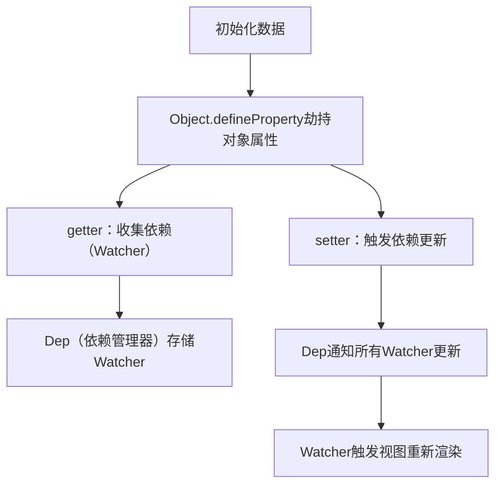
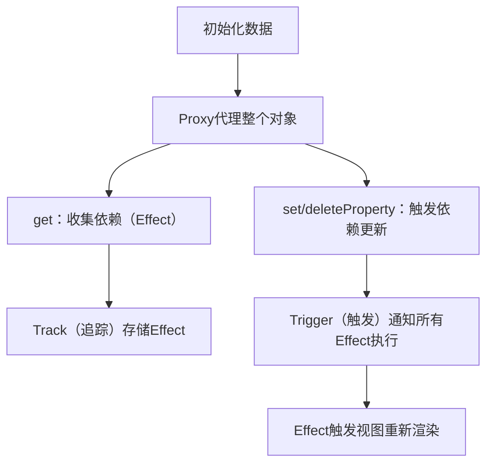
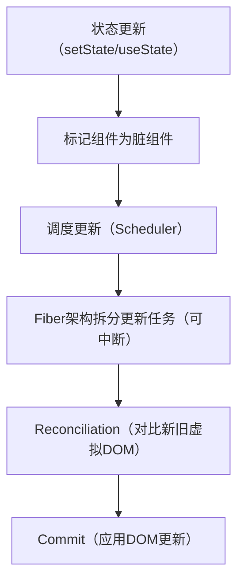

# 前端框架响应式原理对比：Vue2、Vue3 与 React

### 一、响应式核心概念（先统一理解）

**响应式**：当数据（状态）发生变化时，视图自动更新，无需手动操作 DOM，是现代前端框架的核心特性。

核心目标：**数据驱动视图**，让开发者专注于数据逻辑，而非 DOM 操作。

### 二、Vue2 响应式实现（Object.defineProperty）

Vue2 的响应式基于 `Object.defineProperty` 实现，核心是「数据劫持 + 依赖收集 + 发布订阅」。

#### 1. 核心原理


#### 2. 关键步骤拆解

##### （1）数据劫持（Object.defineProperty）

对 `data` 中的所有属性递归执行 `Object.defineProperty`，重写 `getter` 和 `setter`：

```JavaScript

function defineReactive(obj, key, val) {
  // 递归劫持子属性（如对象嵌套）
  observe(val);
  
  // 依赖管理器：存储当前属性的所有Watcher
  const dep = new Dep();

  Object.defineProperty(obj, key, {
    enumerable: true,
    configurable: true,
    // 读取属性时触发：收集依赖
    get() {
      // Dep.target 是当前正在渲染的Watcher
      if (Dep.target) {
        dep.addSub(Dep.target); // 收集Watcher
      }
      return val;
    },
    // 修改属性时触发：通知更新
    set(newVal) {
      if (newVal === val) return;
      val = newVal;
      observe(newVal); // 新值是对象则递归劫持
      dep.notify(); // 通知所有Watcher更新
    }
  });
}

// 递归劫持对象所有属性
function observe(obj) {
  if (typeof obj !== 'object' || obj === null) return;
  new Observer(obj);
}

class Observer {
  constructor(obj) {
    if (Array.isArray(obj)) {
      // 数组重写原型方法（push/pop等）
      this.observeArray(obj);
    } else {
      this.walk(obj);
    }
  }
  
  // 劫持对象属性
  walk(obj) {
    Object.keys(obj).forEach(key => defineReactive(obj, key, obj[key]));
  }
  
  // 劫持数组元素
  observeArray(arr) {
    arr.forEach(item => observe(item));
  }
}
```

##### （2）依赖收集（Dep + Watcher）

- **Dep**：依赖管理器，每个响应式属性对应一个 Dep，存储所有依赖该属性的 Watcher；

- **Watcher**：观察者，分为「渲染 Watcher」（对应组件渲染）、「计算属性 Watcher」、「侦听器 Watcher」；

- 当组件渲染时，读取 `data` 属性触发 `getter`，将当前 Watcher 加入 Dep；

##### （3）发布订阅（触发更新）

当属性修改触发 `setter` 时，Dep 通知所有 Watcher 执行更新，最终触发组件重新渲染。

#### 3. Vue2 响应式的局限性（面试高频）

1. **对象新增/删除属性无法检测**：`Object.defineProperty` 只能劫持已存在的属性，需用 `Vue.set`/`this.$set` 手动处理；

2. **数组下标/长度修改无法检测**：如 `arr[0] = 1`、`arr.length = 0` 无法触发更新，需用重写的数组方法（`push/pop/shift/unshift/splice/sort/reverse`）；

3. **深层嵌套对象劫持性能较差**：初始化时递归劫持所有属性，大对象初始化耗时；

4. **不支持 Map/Set 等新数据结构**。

### 三、Vue3 响应式实现（Proxy + Reflect）

Vue3 重写响应式系统，基于 ES6 的 `Proxy` 实现，解决了 Vue2 的所有局限性，核心仍是「依赖收集 + 发布订阅」，但劫持粒度从「属性」提升到「对象」。

#### 1. 核心原理


#### 2. 关键步骤拆解

##### （1）对象代理（Proxy + Reflect）

```JavaScript

function reactive(obj) {
  return new Proxy(obj, {
    // 读取属性（包括数组下标、对象属性）时触发
    get(target, key, receiver) {
      const res = Reflect.get(target, key, receiver);
      // 收集依赖：追踪当前key的Effect
      track(target, key);
      // 递归代理嵌套对象（懒劫持，访问时才代理）
      if (typeof res === 'object' && res !== null) {
        return reactive(res);
      }
      return res;
    },
    // 修改/新增属性时触发
    set(target, key, value, receiver) {
      const oldVal = Reflect.get(target, key, receiver);
      const result = Reflect.set(target, key, value, receiver);
      // 只有值变化才触发更新
      if (oldVal !== value) {
        // 触发依赖：通知所有Effect更新
        trigger(target, key);
      }
      return result;
    },
    // 删除属性时触发
    deleteProperty(target, key) {
      const hadKey = Reflect.has(target, key);
      const result = Reflect.deleteProperty(target, key);
      if (hadKey) {
        trigger(target, key);
      }
      return result;
    }
  });
}
```

##### （2）依赖收集与触发（Track + Trigger）

- **Effect**：替代 Vue2 的 Watcher，是响应式副作用函数（组件渲染、计算属性、侦听器都是 Effect）；

- **Track**：在 `get` 时收集当前 Effect 与目标对象/key 的映射关系；

- **Trigger**：在 `set/delete` 时根据目标对象/key 找到所有 Effect 并执行。

#### 3. Vue3 响应式的优势（对比 Vue2）

1. **支持对象新增/删除属性**：Proxy 代理整个对象，而非单个属性；

2. **支持数组下标/长度修改**：`arr[0] = 1`、`arr.length = 0` 可直接检测；

3. **懒劫持**：嵌套对象只有访问时才代理，初始化性能提升；

4. **支持 Map/Set/WeakMap/WeakSet** 等新数据结构；

5. **Reflect 保证操作语义正确**：统一返回操作结果（布尔值），避免 `Object.defineProperty` 的陷阱。

#### 4. Vue3 响应式 API 分类（面试高频）

|API|作用|示例|
|---|---|---|
|`reactive`|代理对象/数组，返回响应式副本|`const obj = reactive({ name: 'vue3' })`|
|`ref`|代理基本类型（字符串/数字等），返回带 `.value` 的响应式对象|`const count = ref(0); count.value++`|
|`computed`|计算属性，依赖变化自动更新|`const double = computed(() => count.value * 2)`|
|`watch`|侦听响应式数据变化|`watch(count, (newVal) => console.log(newVal))`|
|`watchEffect`|自动追踪依赖，无需指定侦听源|`watchEffect(() => console.log(count.value))`|
### 四、React 响应式实现（状态更新机制）

React 没有「数据劫持」概念，其响应式核心是「状态更新触发重新渲染」，基于「虚拟 DOM + 状态驱动」实现，核心是「不可变数据 + 重新渲染」。

#### 1. 核心原理


#### 2. 关键步骤拆解

##### （1）状态定义与更新

- **类组件**：`this.state` 存储状态，`this.setState` 触发更新（异步更新，批量处理）；

- **函数组件**：`useState/useReducer` 定义状态，调用 setState 函数触发更新；

- 核心规则：**状态是不可变的**，必须通过 setState 替换状态，而非直接修改（如 `setCount(count + 1)` 而非 `count++`）。

##### （2）更新调度（Scheduler）

React 16+ 引入 Scheduler，将更新任务拆分为小任务，优先级高的任务（如用户输入）优先执行，避免阻塞主线程。

##### （3）Reconciliation（协调）与 Commit（提交）

- **协调阶段**：异步对比新旧 Fiber 节点（虚拟 DOM），标记需要更新的节点（`effectTag`）；

- **提交阶段**：同步执行 DOM 更新，应用所有标记的修改。

#### 3. React 响应式的特点（面试高频）

1. **不可变数据**：状态更新必须返回新值（如数组用 `[...arr, newVal]`，对象用 `{ ...obj, key: val }`），否则无法触发重新渲染；

2. **非精确更新**：状态更新默认触发组件自身及所有子组件重新渲染（需用 `React.memo`/`useMemo`/`useCallback` 优化）；

3. **异步更新**：`setState`/`useState` 的更新是异步的（批量处理），无法立即获取最新状态；

4. **无数据劫持**：React 不劫持数据，而是通过「状态更新函数」主动触发渲染，更接近原生 JS 逻辑。

### 五、Vue2/Vue3/React 响应式核心差异

|维度|Vue2|Vue3|React|
|---|---|---|---|
|实现底层|Object.defineProperty（劫持属性）|Proxy + Reflect（劫持对象）|状态更新 + 虚拟 DOM Diff（无劫持）|
|数据可变性|可变（可直接修改属性）|可变（可直接修改属性）|不可变（必须替换状态）|
|更新粒度|精准更新（依赖收集，只更新用到数据的组件）|精准更新（Effect 追踪，更细粒度）|粗粒度（组件级更新，需手动优化）|
|更新时机|同步（修改数据立即触发更新）|同步（默认）/异步（Suspense 实验性）|异步（批量更新，Scheduler 调度）|
|嵌套对象处理|初始化递归劫持（性能差）|懒劫持（访问时才代理，性能优）|无劫持，需手动替换嵌套对象|
|数组支持|重写原型方法，下标/长度修改不支持|原生支持数组所有操作|需替换数组（如 [...arr]）触发更新|
|核心优势|兼容性好（支持 IE9+）|功能完整、性能优、支持新数据结构|异步可中断更新，适合复杂应用|
|核心劣势|有诸多局限性（新增属性/数组下标）|兼容性差（Proxy 不支持 IE）|更新粒度粗，需手动优化性能|
### 六、面试高频考点补充

#### 1. Vue3 中 ref 和 reactive 的区别

- `ref` 用于基本类型（字符串/数字等），返回带 `.value` 的响应式对象，可直接解构；

- `reactive` 用于对象/数组，返回代理对象，解构会丢失响应式（需用 `toRefs/toRef`）；

- 底层：`ref` 内部仍是通过 `reactive` 实现，本质是 `reactive({ value: 原始值 })`。

#### 2. React 为什么要求状态不可变

- React 无法检测对象/数组的内部修改，只能通过「引用变化」判断状态是否更新；

- 不可变数据保证了虚拟 DOM Diff 的准确性，避免重复渲染或漏渲染；

- 不可变数据便于回溯状态（如时间旅行调试）。

#### 3. Vue 依赖收集的时机

组件首次渲染时，读取响应式数据触发 `getter`，此时收集当前组件的 Watcher/Effect，后续数据变化只通知这些依赖的组件更新。

### 总结

1. **核心实现差异**：

    - Vue 是「数据劫持 + 依赖收集」，精准更新用到数据的组件；

    - React 是「状态更新 + 虚拟 DOM Diff」，默认组件级更新，需手动优化。

2. **数据可变性**：

    - Vue 支持可变数据，修改属性即可触发更新；

    - React 要求不可变数据，必须替换状态才能触发更新。

3. **面试高频**：

    - Vue2 响应式的局限性及 Vue3 的改进；

    - Proxy 相比 Object.defineProperty 的优势；

    - React 状态不可变的原因及优化手段（React.memo/useMemo）；

    - 三者更新机制的核心区别（精准更新 vs 粗粒度更新）。
> （注：文档部分内容可能由 AI 生成）